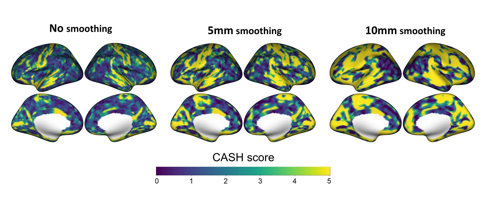

# SAN

**Spatial Autocorrelation Normalization**

R package to apply SAN to harmonize heterogeneous spatial covariances in multi-site, multi-scanner neuroimaging studies. 

### References

> Zhang, R., Chen, L., Oliver, L. D., Voineskos, A. N., Park, J. Y. (2023+). SAN: mitigating spatial covariance heterogeneity in cortical thickness data collected from multiple scanners or sites. [link](https://doi.org/10.1101/2023.12.04.569619)

## Contents

1. [Background](#id-background)
2. [Installation](#id-installation)
3. [Usage](#id-san)
4. [Distance matrix](#id-distance)
5. [CASH score](#id-cash)

---

<div id='id-background'/>


### Background
SAN supports harmonizing vertex-level neuroimaging data (e.g., cortical thickness) collected from multiple sites and/or scanners. By using a distance matrix to model covariance heterogeneity probabilistically, SAN provides promising harmonization performance than other methods.


<div id='id-installation'/>

---

### Installation
To install the latest development builds directly from GitHub, please run the followings:

```R
if (!require("devtools"))
  install.packages("devtools")
devtools::install_github("junjypark/SAN")
```

<div id='id-distance'/>

<div id='id-san'/>

---

### Usage

`SAN()` is the main function that takes (almost)  the same input names as [neuroCombat](https://github.com/Jfortin1/neuroCombat_Rpackage). Specifically, the following need to be provided.

* `dat`: a (p x n) data matrix, where p is the number of features and n is the number of subjects (required)
* `batch`: Batch variable for the scanner id (required)
* `mod`: a (n x q) matrix containing biological covariates (optional). This can be obtained by using `model.matrix()` function in R. However, when you use `mod` in SAN, ensure your covariate of interest (for hypothesis testing) is excluded. In practice, SAN preserves covariate effects well even though it is not specified as an input.
* `distMat`: a (p x p) matrix containing pairwise distance information. The diagonal entrys should have 0 values.


Now, the `SAN` can be applied to obtain the harmonized data.

```R
fit = SAN(dat=dat, batch=batch, mod=mod, distMat=distMat)
``` 

---

### Distance matrix

We recommend using geodesic distance for mesh surfaces. You may use [Python](https://pypi.org/project/pygeodesic/) or [C++](https://code.google.com/archive/p/geodesic/wikis/ExactGeodesic.wiki) to obtain a pairwise geodesic distance matrix.

It requires the extraction of `vertices` and `faces` matrices. The `vertices` matrix contains the 3D coordinate for each vertex, and each row of the `faces` matrix contains the indices of three vertices that construct a triangle in the mesh surface. In Freesurfer, the surface file (e.g. `lh.pial` (recommended) or `lh.inflated`) can be used to extract vertices and faces (see `read.fs.surface()` in the freesurferformats R package). Once you load `vertices` and `faces`, the following manipulation is necessary due to the difference between R and Python.

```R
surf$faces = surf$faces-1
```


<div id='id-cash'/>

---

### CASH score


CASH score can be used to quantify local covariance heterogeneity of the raw imaging data. It can be implemented using `covarF()` function provided in this package.


<figure>

<figcaption aria-hidden="true"> CASH score brain map </figcaption>
</figure>


